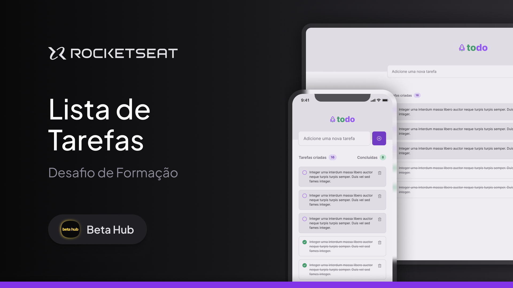

<p align="center">
  
</p>

<p align="center">
  

  

  
</p>

<h1 align="center">
    
</h1>

<br>

## 🧪 Tecnologias

Esse projeto foi desenvolvido com as seguintes tecnologias:

- [React Native](https://reactnative.dev/)
- [Expo](https://expo.dev/)
- [TypeScript](https://www.typescriptlang.org/)
- [Moti](https://moti.fyi/)
- [Zustand](https://zustand-demo.pmnd.rs/)

## 🚀 Como executar

Clone o projeto e acesse a pasta do mesmo.

```bash
gh repo clone rudneyrodrigues/todolist-rn
```

```bash
cd todolist-rn
```

Para iniciá-lo, siga os passos abaixo:

```bash
# Instalar as dependências
npm i
```

```bash
# Iniciar projeto
npm run start
```

## 💻 Projeto

O projeto consiste em uma aplicação de lista de tarefas, onde o usuário pode adicionar, remover e marcar como concluídas as tarefas. A aplicação é desenvolvida com React Native e utiliza o Expo para facilitar o desenvolvimento e testes em dispositivos móveis.

## 🔖 Layout

Você pode visualizar o layout do projeto através do link abaixo:

- [Layout Web](https://www.figma.com/community/file/1375099231017788190/lista-de-tarefas)

## License

[MIT](LICENSE) © [Rudney Rodrigues do Nascimento](https://rudneyrodrigues.dev.br)
